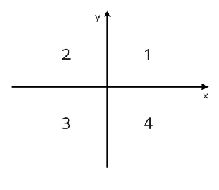

# **Знакомство с языками программирования (семинары) GeekBrains. Язык программирования C#** 

# `Семинарские практические задания.`

## Решение практических заданий к семинарам:

**Seminar 1** - [Перейти](https://github.com/Yana-Sushkova/C_Sharp_portfolio/blob/main/README.md#Seminar_1 "Перейти к уроку")

**Seminar 2** - [Перейти](https://github.com/Yana-Sushkova/C_Sharp_portfolio/blob/main/README.md#Seminar_2 "Перейти к уроку")

**Seminar 3** - [Перейти](https://github.com/Yana-Sushkova/C_Sharp_portfolio/blob/main/README.md#Seminar_3 "Перейти к уроку")

**Seminar 4** - [Перейти](https://github.com/Yana-Sushkova/C_Sharp_portfolio/blob/main/README.md#Seminar_4 "Перейти к уроку")

**Seminar 5** - [Перейти](https://github.com/Yana-Sushkova/C_Sharp_portfolio/blob/main/README.md#Seminar_5 "Перейти к уроку")

**Seminar 6** - [Перейти](https://github.com/Yana-Sushkova/C_Sharp_portfolio/blob/main/README.md#Seminar_6 "Перейти к уроку")

**Seminar 7** - [Перейти](https://github.com/Yana-Sushkova/C_Sharp_portfolio/blob/main/README.md#Seminar_7 "Перейти к уроку")

**Seminar 8** - [Перейти](https://github.com/Yana-Sushkova/C_Sharp_portfolio/blob/main/README.md#Seminar_8 "Перейти к уроку")

**Seminar 9** - [Перейти](https://github.com/Yana-Sushkova/C_Sharp_portfolio/blob/main/README.md#Seminar_9 "Перейти к уроку")

...

## [Seminar_1](https://github.com/Yana-Sushkova/C_Sharp_portfolio/tree/main/Seminar%201 "Задачи к Семинару 1")

### Задача 0: 
Напишите программу которая на вход принимает число и выдает его 
квадрат (число умноженное само на себя)
```
Пример:
4 -> 16
-3 -> 9
-7 -> 49
```
>[Решение](https://github.com/Yana-Sushkova/C_Sharp_portfolio/blob/main/Seminar%201/Task%200/Program.cs "Решение задачи 0")

### Задача 1: 
Напишите программу, которая на вход принимает два числа и проверяет, является ли первое число квадратом второго
```
Пример:
a = 25, b = 5 -> да
a = 2, b = 10 -> нет
a = 9, b = -3 -> да
a = -3 b = 9 -> нет
```
>[Решение](https://github.com/Yana-Sushkova/C_Sharp_portfolio/blob/main/Seminar%201/Task%201/Program.cs "Решение задачи 1")

### Задача 2:
Напишите программу, которая на вход принимает два числа и выдаёт, какое число большее, а какое меньшее.
```
Пример:
a = 5; b = 7 -> max = 7
a = 2 b = 10 -> max = 10
a = -9 b = -3 -> max = -3
```
>[Решение](https://github.com/Yana-Sushkova/C_Sharp_portfolio/blob/main/Seminar%201/Task%202/Program.cs "Решение задачи 2")

### Задача 3:
Напишите программу, которая будет выдавать название дня недели по заданному номеру.
```
Пример:
3 -> Среда
5 -> Пятница
```
>[Решение](https://github.com/Yana-Sushkova/C_Sharp_portfolio/blob/main/Seminar%201/Task%203/Program.cs "Решение задачи 3")


### Задача 4:
Напишите программу, которая принимает на вход три числа и выдаёт максимальное из этих чисел.
```
Пример:
2 3 7 -> 7
44 5 78 -> 78
22 3 9 -> 22
```
>[Решение](https://github.com/Yana-Sushkova/C_Sharp_portfolio/blob/main/Seminar%201/Task%204/Program.cs "Решение задачи 4")

### Задача 5:
Напишите программу, которая на вход принимает одно число (N), а на выходе показывает все целые числа в промежутке от -N до N.
```
Пример:
4 -> "-4, -3, -2, -1, 0, 1, 2, 3, 4"
2 -> " -2, -1, 0, 1, 2"
```
>[Решение](https://github.com/Yana-Sushkova/C_Sharp_portfolio/blob/main/Seminar%201/Task%205/Program.cs "Решение задачи 5")

### Задача 6:
Напишите программу, которая на вход принимает число и выдаёт, является ли число чётным (делится ли оно на два без остатка).
```
Пример:
4 -> да
-3 -> нет
7 -> нет
```
>[Решение](https://github.com/Yana-Sushkova/C_Sharp_portfolio/blob/main/Seminar%201/Task%206/Program.cs "Решение задачи 6")

### Задача 7:
Напишите программу, которая принимает на вход трёхзначное число и на выходе показывает последнюю цифру этого числа.
```
Пример:
456 -> 6
782 -> 2
918 -> 8
```
>[Решение](https://github.com/Yana-Sushkova/C_Sharp_portfolio/blob/main/Seminar%201/Task%207/Program.cs "Решение задачи 7")

### Задача 8:
Напишите программу, которая на вход принимает число (N), а на выходе показывает все чётные числа от 1 до N.
```
Пример:
5 -> 2, 4
8 -> 2, 4, 6, 8
```
>[Решение](https://github.com/Yana-Sushkova/C_Sharp_portfolio/blob/main/Seminar%201/Task%208/Program.cs "Решение задачи 8")

***

## [Seminar_2](https://github.com/Yana-Sushkova/C_Sharp_portfolio/tree/main/Seminar%202 "Задачи к Семинару 2")

### Задача 9:
Напишите программу, которая выводит случайное число из отрезка [10, 99] и показывает
наибольшую цифру числа.
```
Пример:
78 -> 8
12-> 2
85 -> 8
```
>[Решение](https://github.com/Yana-Sushkova/C_Sharp_portfolio/blob/main/Seminar%202/Task%209/Program.cs "Решение задачи 9")

### Задача 10:
Напишите программу, которая принимает на вход трёхзначное число и на выходе показывает вторую цифру этого числа.
```
Пример:
456 -> 5
782 -> 8
918 -> 1
```
>[Решение](https://github.com/Yana-Sushkova/C_Sharp_portfolio/blob/main/Seminar%202/Task%2010/Program.cs "Решение задачи 10")

### Задача 11:
Напишите программу, которая выводит случайное трёхзначное число и удаляет вторую цифру этого числа.
```
Пример:
456 -> 46
782 -> 72
918 -> 98
```
>[Решение](https://github.com/Yana-Sushkova/C_Sharp_portfolio/blob/main/Seminar%202/Task%2011/Program.cs "Решение задачи 11")

### Задача 12:
Напишите программу, которая будет принимать на вход два числа и выводить, является ли второе число кратным первому. Если число 2 не кратно числу 1, то программа выводит остаток от деления.
```
Пример:
34, 5 -> не кратно, остаток 4
16, 4 -> кратно
```
>[Решение](https://github.com/Yana-Sushkova/C_Sharp_portfolio/blob/main/Seminar%202/Task%2012/Program.cs "Решение задачи 12")

### Задача 13:
Напишите программу, которая выводит третью цифру заданного числа или сообщает, что третьей цифры нет.
```
Пример:
645 -> 5
78 -> третьей цифры нет
32679 -> 6
```
>[Решение 1](https://github.com/Yana-Sushkova/C_Sharp_portfolio/blob/main/Seminar%202/Task%2013/Program.cs "Решение 1 задачи 13")

>[Решение 2](https://github.com/Yana-Sushkova/C_Sharp_portfolio/blob/main/Seminar%202/Task%2013_2/Program.cs "Решение 2 задачи 13")

### Задача 14:
Напишите программу, которая принимает на вход число и проверяет, кратно ли оно одновременно 7 и 23.
```
Пример:
14 -> нет
46 -> нет
161 -> да
```
>[Решение](https://github.com/Yana-Sushkova/C_Sharp_portfolio/blob/main/Seminar%202/Task%2014/Program.cs "Решение задачи 14")

### Задача 15:
Напишите программу, которая принимает на вход цифру, обозначающую день недели, и проверяет, является ли этот день выходным.
```
Пример:
6 -> да
7 -> да
1 -> нет
```
>[Решение](https://github.com/Yana-Sushkova/C_Sharp_portfolio/blob/main/Seminar%202/Task%2015/Program.cs "Решение задачи 15")

### Задача 16:
Напишите программу, которая принимает на вход два числа и проверяет, является ли одно
число квадратом другого.
```
Пример:
5, 25 -> да
-4, 16 -> да
25, 5 -> да
8,9 -> нет
```
>[Решение](https://github.com/Yana-Sushkova/C_Sharp_portfolio/blob/main/Seminar%202/Task%2016/Program.cs "Решение задачи 16")

***

## [Seminar_3](https://github.com/Yana-Sushkova/C_Sharp_portfolio/tree/main/Seminar%203 "Задачи к Семинару 3")

### Задача 17:
Напишите программу, которая принимает на вход координаты точки (X и Y), причем X ≠ 0 и Y ≠ 0 и выдаёт номер четверти
плоскости, в которой находится эта точка.
```
Пример:
```
 

>[Решение 1](https://github.com/Yana-Sushkova/C_Sharp_portfolio/blob/main/Seminar%203/Task%2017_1/Program.cs "Решение задачи 17_1")

>[Решение 2](https://github.com/Yana-Sushkova/C_Sharp_portfolio/blob/main/Seminar%203/Task%2017_2/Program.cs "Решение задачи 17_2")

>[Решение 3](https://github.com/Yana-Sushkova/C_Sharp_portfolio/blob/main/Seminar%203/Task%2017_3/Program.cs "Решение задачи 17_3")

### Задача 18:
Напишите программу, которая по заданному номеру четверти, показывает диапазон возможных координат
точек в этой четверти (x и y).
```
Пример:
нет
```
>[Решение](https://github.com/Yana-Sushkova/C_Sharp_portfolio/blob/main/Seminar%203/Task%2018/Program.cs "Решение задачи 18")

### Задача 19:
Напишите программу, которая принимает на вход пятизначное число и проверяет, является ли оно палиндромом.
```
Пример:
14212 -> нет
12821 -> да
23432 -> да
```
>[Решение](https://github.com/Yana-Sushkova/C_Sharp_portfolio/blob/main/Seminar%203/Task%2019/Program.cs "Решение задачи 19")

### Задача 20:
Напишите программу, которая принимает на вход координаты двух точек и находит расстояние между
ними в 2D пространстве.
```
Пример:
A (3,6); B (2,1) -> 5,09
A (7,-5); B (1,-1) -> 7,21
```
>[Решение](https://github.com/Yana-Sushkova/C_Sharp_portfolio/blob/main/Seminar%203/Task%2020/Program.cs "Решение задачи 20")

### Задача 21:
Напишите программу, которая принимает на вход координаты двух точек и находит расстояние между ними в 3D пространстве.
```
Пример:
A (3,6,8); B (2,1,-7), -> 15.84
A (7,-5, 0); B (1,-1,9) -> 11.53
```
>[Решение](https://github.com/Yana-Sushkova/C_Sharp_portfolio/blob/main/Seminar%203/Task%2021/Program.cs "Решение задачи 21")

### Задача 22:
Напишите программу, которая принимает на вход число (N) и выдаёт таблицу квадратов чисел
от 1 до N.
```
Пример:
5 -> 1, 4, 9, 16, 25.
2 -> 1,4
```
>[Решение](https://github.com/Yana-Sushkova/C_Sharp_portfolio/blob/main/Seminar%203/Task%2022/Program.cs "Решение задачи 22")

### Задача 23:
Напишите программу, которая принимает на вход число (N) и выдаёт таблицу кубов чисел от 1 до N.
```
Пример:
3 -> 1, 8, 27
5 -> 1, 8, 27, 64, 125
```
>[Решение](https://github.com/Yana-Sushkova/C_Sharp_portfolio/blob/main/Seminar%203/Task%2023/Program.cs "Решение задачи 23")

***

## [Seminar_4](https://github.com/Yana-Sushkova/C_Sharp_portfolio/tree/main/Seminar%204  "Задачи к Семинару 4")

### Задача 24:
Напишите программу, которая принимает на вход число (А) и выдаёт сумму чисел от 1 до А
```
Пример:
7 -> 28
4 -> 10
8 -> 36
```
>[Решение](https://github.com/Yana-Sushkova/C_Sharp_portfolio/blob/main/Seminar%204/Task%2024/Program.cs "Решение задачи 24")

### Задача 25:
Напишите программу, которая принимает на вход два числа (A и B) и возводит число A в натуральную степень B. Для решения задания использование цикла for является обязательным условием. Не использовать встроенный метод возведения в степень.
```
Пример:
3, 5 -> 243 (3⁵)
2, 4 -> 16
```
>[Решение](https://github.com/Yana-Sushkova/C_Sharp_portfolio/blob/main/Seminar%204/Task%2025/Program.cs "Решение задачи 25")

### Задача 26:
Напишите программу, которая принимает на вход число и выдаёт количество цифр в числе.
```
Пример:
456 -> 3
78 -> 2
89126 -> 5
```
>[Решение](https://github.com/Yana-Sushkova/C_Sharp_portfolio/blob/main/Seminar%204/Task%2026/Program.cs "Решение задачи 25")

### Задача 27:
Напишите программу, которая принимает на вход число и выдаёт сумму цифр в числе. Для решения задания использование цикла for является обязательным условием.
```
Пример:
452 -> 11
82 -> 10
9012 -> 12
```
>[Решение](https://github.com/Yana-Sushkova/C_Sharp_portfolio/blob/main/Seminar%204/Task%2027/Program.cs "Решение задачи 27")

### Задача 28:
Напишите программу, которая принимает на вход число N и выдаёт произведение чисел от 1 до N
```
Пример:
4 -> 24 
5 -> 120
```
>[Решение](https://github.com/Yana-Sushkova/C_Sharp_portfolio/blob/main/Seminar%204/Task%2028/Program.cs "Решение задачи 28")

### Задача 29:
Напишите программу, которая задаёт массив из 8 элементов и выводит их на экран. 
Заполнение массива производит пользователь.
```
Пример:
1, 2, 5, 7, 19 -> [1, 2, 5, 7, 19] 
6, 1, 33 -> [6, 1, 33] 

P.S. В примерах не 8 элементов в массиве, ориентировалась на примеры.
```
>[Решение](https://github.com/Yana-Sushkova/C_Sharp_portfolio/blob/main/Seminar%204/Task%2029/Program.cs "Решение задачи 29")

### Задача 30:
Напишите программу, которая выводит массив из 8 элементов, заполненный нулями и единицами в случайном порядке.
```
Пример:
[1,0,1,1,0,1,0,0]
```
>[Решение](https://github.com/Yana-Sushkova/C_Sharp_portfolio/blob/main/Seminar%204/Task%2030/Program.cs "Решение задачи 29")

***

## [Seminar_5](https://github.com/Yana-Sushkova/C_Sharp_portfolio/tree/main/Seminar%205  "Задачи к Семинару 5")

### Задача 31:
Задайте массив из 12 элементов, заполненный случайными числами  из промежутка [-9, 9]. Найдите сумму отрицательных и положительных
элементов массива.
```
Пример:
В массиве [3,9,-8,1,0,-7,2,-1,8,-3,-1,6] сумма 
положительных чисел равна 29, сумма отрицательных равна -20
```
>[Решение](https://github.com/Yana-Sushkova/C_Sharp_portfolio/blob/main/Seminar%205/Task%2031/Program.cs "Решение задачи 31")

### Задача 32:
Напишите программу замена элементов массива: положительные элементы замените на соответствующие отрицательные, и наоборот.
```
Пример:
[-4, -8, 8, 2] -> [4, 8, -8, -2]
```
>[Решение](https://github.com/Yana-Sushkova/C_Sharp_portfolio/blob/main/Seminar%205/Task%2032/Program.cs "Решение задачи 32")

### Задача 33:
Задайте массив. Напишите программу, которая определяет, присутствует ли заданное число в массиве.
```
Пример:
4; массив [6, 7, 19, 345, 3] -> нет
-3; массив [6, 7, 19, 345, 3] -> да
```
>[Решение](https://github.com/Yana-Sushkova/C_Sharp_portfolio/blob/main/Seminar%205/Task%2033/Program.cs "Решение задачи 33")

### Задача 34:
Задайте массив заполненный случайными положительными трёхзначными числами. Напишите программу, которая покажет 
количество чётных чисел в массиве.
```
Пример:
[345, 897, 568, 234] -> 2
```
>[Решение](https://github.com/Yana-Sushkova/C_Sharp_portfolio/blob/main/Seminar%205/Task%2034/Program.cs "Решение задачи 34")

### Задача 35:
Задайте одномерный массив из 123 случайных чисел. 
Найдите количество элементов массива, значения которых лежат в отрезке [10,99]. 
Пример для массива из 5, а не 123 элементов. В своём решении сделайте для 123.
```
Пример:
[5, 18, 123, 6, 2] -> 1
[1, 2, 3, 6, 2] -> 0
[10, 11, 12, 13, 14] -> 5
```
>[Решение](https://github.com/Yana-Sushkova/C_Sharp_portfolio/blob/main/Seminar%205/Task%2035/Program.cs "Решение задачи 35")

### Задача 36:
Задайте одномерный массив, заполненный случайными числами.  Найдите сумму элементов, стоящих на нечётных позициях.
```
Пример:
[3, 7, 23, 12] -> 19
[-4, -6, 89, 6] -> 0
```
>[Решение](https://github.com/Yana-Sushkova/C_Sharp_portfolio/blob/main/Seminar%205/Task%2036/Program.cs "Решение задачи 36")

### Задача 37:
Найдите произведение пар чисел в одномерном массиве.  
Парой считаем первый и последний элемент, второй и предпоследний и т.д.
Результат запишите в новом массиве.

```
Пример:
[1 2 3 4 5] -> 5 8 3
[6 7 3 6] -> 36 21
```
>[Решение](https://github.com/Yana-Sushkova/C_Sharp_portfolio/blob/main/Seminar%205/Task%2037/Program.cs "Решение задачи 37")

### Задача 38:
Задайте массив вещественных чисел. Найдите разницу между максимальным и минимальным элементов массива.
```
Пример:
[3 7 22 2 78] -> 76
```
>[Решение](https://github.com/Yana-Sushkova/C_Sharp_portfolio/blob/main/Seminar%205/Task%2038/Program.cs "Решение задачи 38")

***

## [Seminar_6](https://github.com/Yana-Sushkova/C_Sharp_portfolio/tree/main/Seminar%206  "Задачи к Семинару 6")

### Задача 41:
Пользователь вводит с клавиатуры M чисел. 
Посчитайте, сколько чисел больше 0 ввёл пользователь.
```
Пример:
0, 7, 8, -2, -2 -> 2
1, -7, 567, 89, 223-> 3 // неверный пример, должно быть 4
```
>[Решение](https://github.com/Yana-Sushkova/C_Sharp_portfolio/blob/main/Seminar%206/Task%2041/Program.cs "Решение задачи 41")

### Задача 43:
Напишите программу, которая найдёт точку пересечения двух прямых, заданных уравнениями y = k1 * x + b1, y = k2 * x + b2; значения b1, k1, b2 и k2 задаются пользователем.
```
Пример:
b1 = 2, k1 = 5, b2 = 4, k2 = 9 -> (-0,5; -0,5)
```
>[Решение](https://github.com/Yana-Sushkova/C_Sharp_portfolio/blob/main/Seminar%206/Task%2043/Program.cs "Решение задачи 43")

***

## [Seminar_7](https://github.com/Yana-Sushkova/C_Sharp_portfolio/tree/main/Seminar%207  "Задачи к Семинару 6")

### Задача 47:
Запросите от пользователя размерности двумерного массива. 
Напишите метод для заполнения массива случайными числами. 
Напишите метод для вывода массива на экран (постарайтесь вывести массив красиво). Округлите значения, генерируемые Random до  двух знаков после запятой.
```
Пример:
m = 3, n = 4.
0,5  7    -2   -0,2
1   -3,3   8   -9,9
8    7,8  -7,1  9
```
>[Решение](https://github.com/Yana-Sushkova/C_Sharp_portfolio/blob/main/Seminar%207/Task%2047/Program.cs "Решение задачи 47")

### Задача 50:
Напишите программу, которая будет принимать от пользователя позицию (M, N) двумерного массива и возвращать значение элемента, стоящего в этой позиции. Если такой позиции в массиве нет, то сообщить об этом пользователю. Сгенерировать массив случайным образом. Размерность массива определить самостоятельно. Использование методов для заполнения массива обязательно. Остальное можно реализовать в главной программе.
```
Пример:
Задан массив:
1 4 7 2
5 9 2 3
8 4 2 4
M = 1, N = 7 -> В массиве отсутствует элемент в такой позиции.
```
>[Решение](https://github.com/Yana-Sushkova/C_Sharp_portfolio/blob/main/Seminar%207/Task%2050/Program.cs "Решение задачи 50")

### Задача 52:
Запросите от пользователя размерности двумерного массива.Напишите метод для заполнения массива случайными числами. Напишите метод для поиска ср. арифметического значения каждого столбца.
```
Пример:
Задан массив:
1 4 7 2
5 9 2 3
8 4 2 4
Среднее арифметическое каждого столбца: 4,6; 5,6; 3,6; 3
```
>[Решение](https://github.com/Yana-Sushkova/C_Sharp_portfolio/blob/main/Seminar%207/Task%2052/Program.cs "Решение задачи 52")

***

## [Seminar_8](https://github.com/Yana-Sushkova/C_Sharp_portfolio/tree/main/Seminar%208  "Задачи к Семинару 8")

### Задача 54:
Задайте двумерный массив. Напишите программу, которая 
упорядочит по убыванию элементы каждой строки двумерного массива.
```
Пример:
Задан массив:
1 4 7 2
5 9 2 3
8 4 2 4
В итоге получается вот такой массив:
7 4 2 1
9 5 3 2
8 4 4 2
```
>[Решение](https://github.com/Yana-Sushkova/C_Sharp_portfolio/blob/main/Seminar%208/Task%2054/Program.cs "Решение задачи 54")

### Задача 56:
Задайте прямоугольный двумерный массив. 
Напишите программу, которая будет находить строку с наименьшей суммой элементов.
```
Пример:
Задан массив:
1 4 7 2
5 9 2 3
8 4 2 4
5 2 6 7
Программа считает сумму элементов в каждой строке и выдаёт номер строки с наименьшей суммой элементов: 1 строка
```
>[Решение](https://github.com/Yana-Sushkova/C_Sharp_portfolio/blob/main/Seminar%208/Task%2056/Program.cs "Решение задачи 56")

### Задача 58:
Задайте две матрицы. Напишите программу, которая будет находить произведение двух матриц.
```
Пример:
Даны 2 матрицы:
2 4 | 3 4
3 2 | 3 3
Результирующая матрица будет:
18 20
15 18 
```
>[Решение](https://github.com/Yana-Sushkova/C_Sharp_portfolio/blob/main/Seminar%208/Task%2058/Program.cs "Решение задачи 58")

### Задача 60:
Сформируйте трёхмерный массив из неповторяющихся двузначных чисел. Напишите программу, которая будет построчно выводить массив, добавляя индексы каждого элемента.
```
Пример:
Массив размером 2 x 2 x 2
66(0,0,0) 25(0,1,0)
34(1,0,0) 41(1,1,0)
27(0,0,1) 90(0,1,1)
26(1,0,1) 55(1,1,1)
```
>[Решение](https://github.com/Yana-Sushkova/C_Sharp_portfolio/blob/main/Seminar%208/Task%2060/Program.cs "Решение задачи 60")

### Задача 62:
Напишите программу, которая заполнит спирально массив 4 на 4
```
Пример:
На выходе получается вот такой массив:
01 02 03 04
12 13 14 05
11 16 15 06
10 09 08 07
```
>[Решение](https://github.com/Yana-Sushkova/C_Sharp_portfolio/blob/main/Seminar%208/Task%2062/Program.cs "Решение задачи 62")

***

## [Seminar_9](https://github.com/Yana-Sushkova/C_Sharp_portfolio/tree/main/Seminar%209  "Задачи к Семинару 9")

### Задача 64:
Задайте значение N. Напишите программу, которая выведет все натуральные числа в промежутке от N до 1. Выполнить с помощью рекурсии.
```
Пример:
N = 5 -> "5, 4, 3, 2, 1"
N = 8 -> "8, 7, 6, 5, 4, 3, 2, 1
```
>[Решение](https://github.com/Yana-Sushkova/C_Sharp_portfolio/blob/main/Seminar%209/Task%2064/Program.cs "Решение задачи 64")

### Задача 66:
Задайте значения M и N. Напишите программу, 
которая найдёт сумму натуральных элементов в промежутке от M до N.

```
Пример:
M = 1; N = 15 -> 120
M = 4; N = 8. -> 30
```
>[Решение](https://github.com/Yana-Sushkova/C_Sharp_portfolio/blob/main/Seminar%209/Task%2066/Program.cs "Решение задачи 66")

### Задача 68:
Напишите программу вычисления функции Аккермана с помощью рекурсии. Даны два неотрицательных числа m и n
```
Пример:
m = 2, n = 3 -> A(m,n) = 9
m = 3, n = 2 -> A(m,n) = 29
```
>[Решение](https://github.com/Yana-Sushkova/C_Sharp_portfolio/blob/main/Seminar%209/Task%2068/Program.cs "Решение задачи 68")


